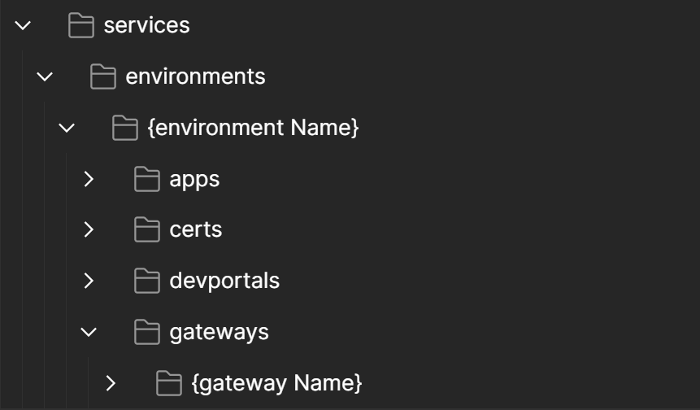
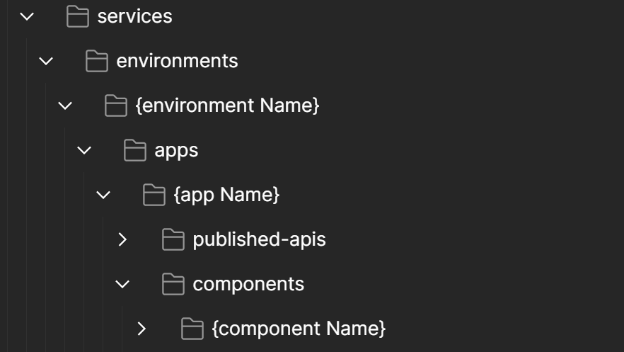
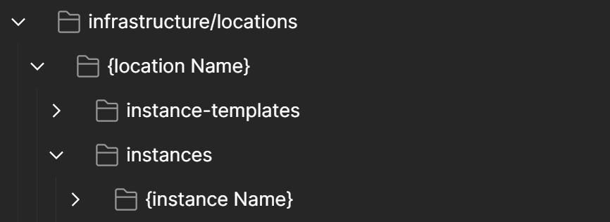

Role Base Access Control
=======================================================================
.. contents:: Table of Contents

Principle
==================================================
A User resource represents an NGINX Controller User account.
Assign Roles to Users to define :

- what actions Users can perform in NGINX Controller
- which ``environment(s)`` Users can access (``gateways``, ``components``...)

- instance ``location(s)`` on which Users can deploy (``placement`` property in ``gateway`` object)

Access determines the Role's ability to access a path or object. The options are:

- ``NONE``: Does not have any access to the path or object
- ``READ``: Has read only access (HTTP GET requests)
- ``WRITE``: Has read and write access (POST, PUT, PATCH requests) but cannot delete
- ``FULL``: Has read, write and delete access

Use Case
==================================================
Organization
###############
A company hosts Applications in Public Cloud.
Applications are grouped by Project (GCP) or Subscription (Azure).
A Project "ACME" nominate:

- "John Doe" as a responsible for App deployment. He needs a FULL access.
- "Jane Doe" as a responsible for Support. She needs only WRITE access on Apps Components.

Configuration
###############
NetOps decided to allocate dedicated WAF resources to ACME: 2 VMs per region France Central, West Europe
NetOps prepared configurations on NGINX Controller:

- Create 2 platform/``location``: ``acme-france_central``, ``acme-west_europe``
- Create 4 platform/``instance``, 2 per location: ``acme-fr-vm1``, ``acme-fr-vm2``, ``acme-we-vm1``, ``acme-we-vm2``
- Create an environment "acme"
- Create a role ``acme_admin_full`` that limits access to ACME's ``locations`` and ACME's ``environment``
- Create a role ``acme_admin_apps`` that limits access to ACME's ``Apps`` only

During a maintenance window, NetOps freeze platform changes to ACME's ``instances``:

- Update role ``acme_admin_full`` to READ access
- Update a role ``acme_admin_apps`` to READ access

Demo
###############

.. raw:: html

    
